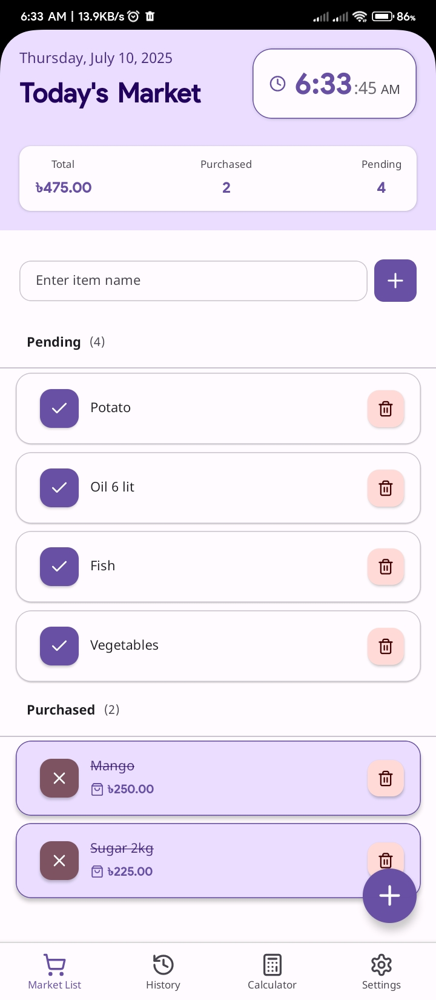
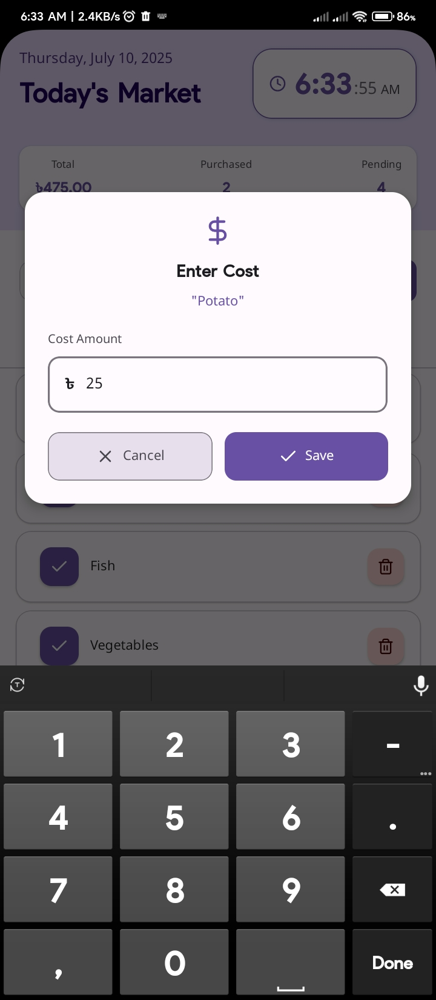
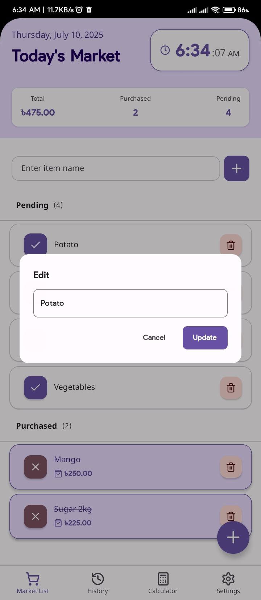
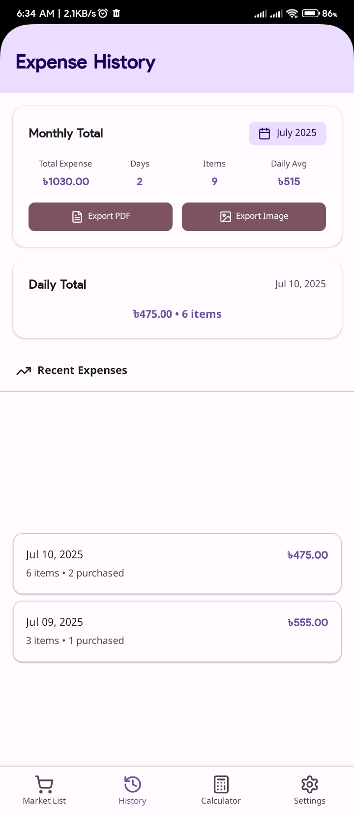
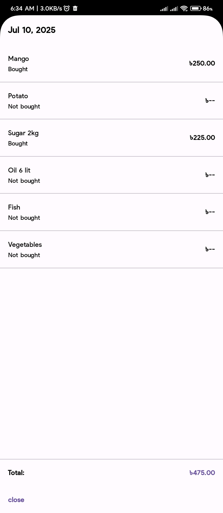
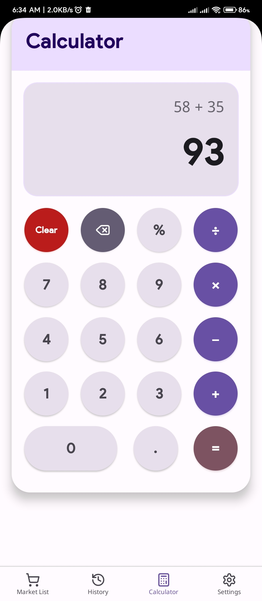
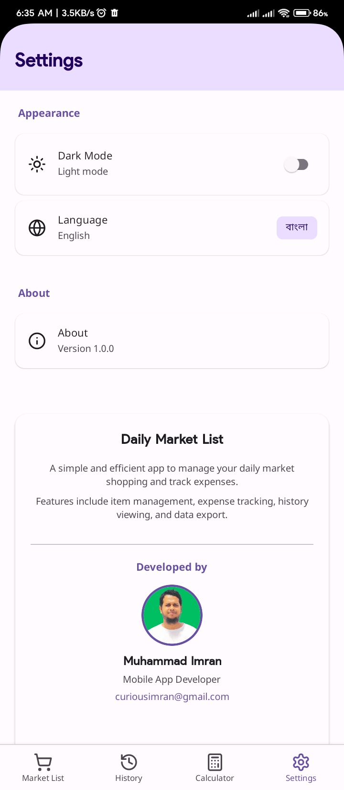
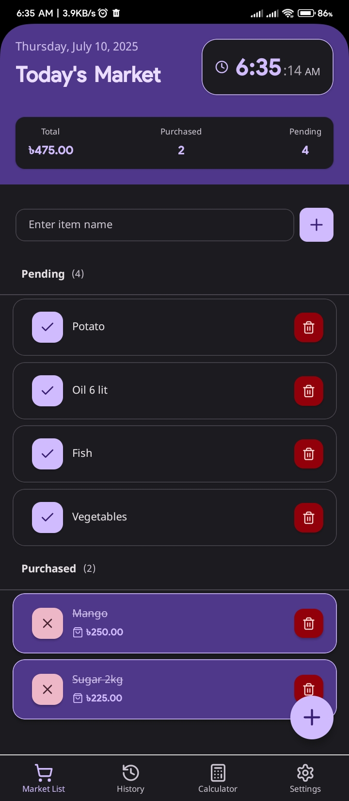
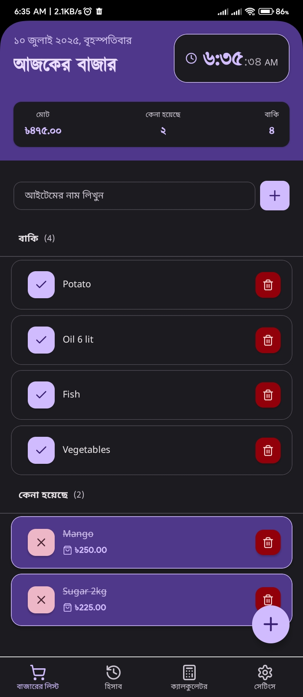
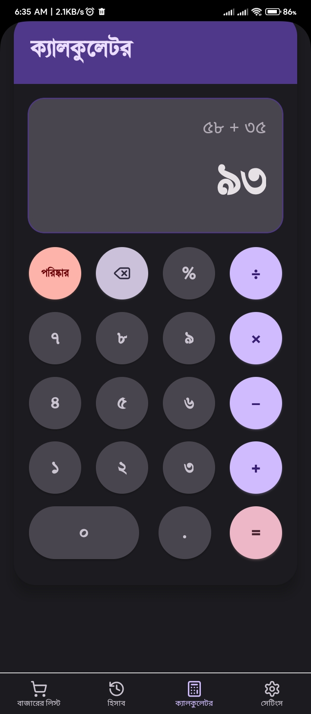

# Bazar List App (বাজারের লিস্ট)

A React Native mobile application for managing shopping lists with Bengali language support. Built with Expo Router and featuring a modern Material Design interface.

## Features

- 📝 **Shopping List Management**: Create and manage daily shopping lists
- 💰 **Cost Tracking**: Track expenses for purchased items
- 🌐 **Bilingual Support**: Full English and Bengali language support
- 🎨 **Dark/Light Theme**: Toggle between dark and light themes
- 📊 **History & Analytics**: View expense history and monthly summaries
- 🧮 **Built-in Calculator**: Simple calculator for quick calculations
- 📱 **Cross-platform**: Works on both iOS and Android

## Screenshots

<div align="center">
  
  
  
  <br/>
  
  
  
  <br/>
  
  
  
  <br/>
  
</div>

## Tech Stack

- **Framework**: React Native with Expo
- **Navigation**: Expo Router
- **State Management**: React Context API
- **Storage**: AsyncStorage for local data persistence
- **UI Components**: Custom components with Material Design principles
- **Icons**: Lucide React Native
- **Date Handling**: date-fns with Bengali locale support

## Getting Started

### Prerequisites

- Node.js (v16 or higher)
- npm or yarn
- Expo CLI
- Android Studio (for Android development)
- Xcode (for iOS development, macOS only)

### Installation

#### Option 1: Download APK (Recommended for users)
1. Go to the [assets/apk](assets/apk/) directory
2. Download the `BazarList.apk` file
3. Enable "Install from Unknown Sources" in your Android settings
4. Install the APK on your device

#### Option 2: Build from source (For developers)
1. Clone the repository:
```bash
git clone https://github.com/curiousimran/bazar-list-app.git
cd bazar-list-app
```

2. Install dependencies:
```bash
npm install
```

3. Start the development server:
```bash
npx expo start
```

4. Run on your device:
   - Install Expo Go app on your phone
   - Scan the QR code from the terminal
   - Or press 'a' for Android emulator or 'i' for iOS simulator

#### Building APK
To build your own APK:
```bash
# For internal testing (APK format)
eas build --platform android --profile internal

# For production (AAB format)
eas build --platform android --profile production
```

## Project Structure

```
project/
├── app/                    # Expo Router pages
│   ├── (tabs)/            # Tab navigation screens
│   │   ├── index.tsx      # Main market list screen
│   │   ├── history.tsx    # Expense history screen
│   │   ├── calculator.tsx # Calculator screen
│   │   └── settings.tsx   # Settings screen
├── components/            # Reusable UI components
│   ├── MarketItem.tsx     # Individual item component
│   ├── CostInputModal.tsx # Cost input modal
│   ├── AddItemModal.tsx   # Add item modal
│   └── TimeWatch.tsx      # Time display component
├── constants/             # App constants
│   ├── Colors.ts          # Theme colors
│   └── Translations.ts    # Language translations
├── contexts/              # React Context providers
│   └── AppContext.tsx     # Main app context
├── types/                 # TypeScript type definitions
│   └── index.ts           # App types
├── assets/                # App assets
│   ├── images/            # App images and icons
│   └── apk/               # Your APK files
│       ├── BazarList.apk  # Your APK file (~100MB)
│       └── README.md      # Installation guide
└── android/               # Android-specific files
```

## Features in Detail

### Shopping List Management
- Add items to your daily shopping list
- Mark items as purchased with cost tracking
- Edit item names
- Delete items from the list
- View pending and purchased items separately

### Cost Tracking
- Enter costs for purchased items
- View total expenses for the day
- Track monthly and daily spending patterns
- Export expense data

### Language Support
- **English**: Full English interface
- **Bengali**: Complete Bengali translation with Bengali digits
- Dynamic language switching
- Bengali date formatting

### Theme Support
- Light theme for daytime use
- Dark theme for low-light environments
- Automatic theme switching based on system preferences

## Contributing

1. Fork the repository
2. Create a feature branch (`git checkout -b feature/amazing-feature`)
3. Commit your changes (`git commit -m 'Add some amazing feature'`)
4. Push to the branch (`git push origin feature/amazing-feature`)
5. Open a Pull Request

## License

This project is licensed under the MIT License - see the [LICENSE](LICENSE) file for details.

## 📦 Download বাজারের লিস্ট (APK)

You can download the latest release of the app here:

👉 [Download APK from GitHub Releases](https://github.com/curiousimran/bazar-list-app/releases/latest)


## Acknowledgments

- Built with [Expo](https://expo.dev/)
- Icons from [Lucide](https://lucide.dev/)
- Date handling with [date-fns](https://date-fns.org/)

## Contact

Your Name - [@curiousimran1](https://x.com/curiousimran1) - curiousimran@gmail.com

Project Link: [https://github.com/curiousimran/bazar-list-app](https://github.com/curiousimran/bazar-list-app) 